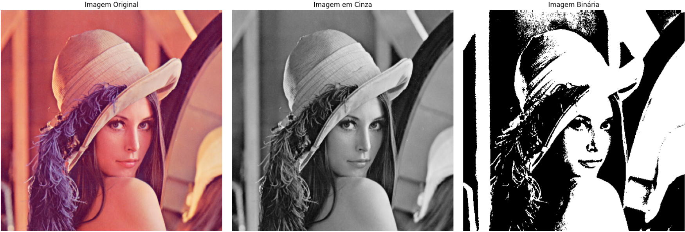

# 🖼️ Conversor de Imagens: Do Colorido ao Binário (Python)

Bem-vindo ao projeto de conversão de imagens! Este é um script em Python, projetado para rodar em ambientes como Google Colab ou Jupyter Notebook, que demonstra os passos fundamentais do processamento de imagens: a conversão de uma imagem colorida para tons de cinza e, em seguida, para uma imagem binária (preto e branco).

O grande diferencial deste projeto é seu propósito educacional: **as funções de conversão foram criadas "do zero"**, sem o uso de bibliotecas de processamento de imagem como OpenCV ou Scikit-Image para a lógica principal. Isso permite um entendimento claro dos algoritmos por trás das transformações.

---

## 🚀 Sobre o Projeto

A redução de dimensionalidade é um conceito chave em computação e aprendizado de máquina. Em imagens, isso pode significar a redução do número de canais de cor (de 3 canais RGB para 1 canal de cinza) ou a simplificação da paleta de cores (de 256 tons de cinza para apenas 2: preto e branco).

Este projeto implementa essas duas etapas de forma clara e didática.

### ✨ Funcionalidades

-   **Conversão para Níveis de Cinza**: Transforma uma imagem colorida (RGB) em uma imagem em tons de cinza (0 a 255) utilizando o **método da luminosidade**, que leva em conta a percepção do olho humano.
-   **Binarização de Imagem**: Converte a imagem em tons de cinza para uma imagem puramente preta e branca com base em um **valor de limiar (threshold)**.

---

## 🛠️ Tecnologias Utilizadas

Este projeto foi construído utilizando as seguintes tecnologias e bibliotecas:

-   **Python 3**: A linguagem de programação principal.
-   **NumPy**: Para manipulação eficiente de matrizes (arrays), que é a forma como a imagem é representada em memória.
-   **Pillow (PIL Fork)**: Utilizada apenas para carregar o arquivo da imagem em um formato que o NumPy possa entender.
-   **Matplotlib**: Para visualizar a imagem original e os resultados das conversões.
-   **Requests**: Para baixar a imagem de exemplo da internet.

---

## 🧠 Conceitos Implementados

### 1. Conversão para Níveis de Cinza (Método da Luminosidade)

Em vez de simplesmente calcular a média dos canais R, G e B, utilizamos uma média ponderada que reflete como nossos olhos percebem as cores. O olho humano é mais sensível ao verde, seguido do vermelho e, por último, do azul. A fórmula padrão (ITU-R BT.601) é:

$$\text{Cinza} = 0.299 \times \text{Vermelho} + 0.587 \times \text{Verde} + 0.114 \times \text{Azul}$$

### 2. Binarização por Limiar (Thresholding)

Este é um dos métodos mais simples de segmentação de imagem. Um valor de limiar (neste projeto, o padrão é 127) é escolhido. Cada pixel da imagem em tons de cinza é comparado a este valor:

-   Se o valor do pixel for **maior** que o limiar, ele se torna **branco** (255).
-   Se o valor do pixel for **menor ou igual** ao limiar, ele se torna **preto** (0).

---

## ⚙️ Como Executar o Projeto

A forma mais fácil de rodar este projeto é usando o **Google Colab**.

1.  **Acesse o Google Colab**: Vá para [colab.research.google.com](https://colab.research.google.com).
2.  **Carregue o Notebook**: Faça o upload do arquivo `.ipynb` do projeto (ou crie um novo e copie o código).
3.  **Execute a Célula**: Execute a célula de código. O script irá automaticamente:
    -   Verificar e instalar as dependências.
    -   Baixar a imagem de exemplo "Lena".
    -   Executar as funções de conversão.
    -   Exibir as três imagens (original, cinza e binária) lado a lado.

Você também pode executá-lo em um ambiente Jupyter local, desde que tenha as bibliotecas listadas instaladas.

---

## 📂 Estrutura do Código no Notebook

O código está organizado em blocos lógicos para facilitar o entendimento:

1.  **Bloco 1: Instalação e Importações**: Prepara o ambiente.
2.  **Bloco 2: Funções de Conversão**: Contém as funções `colorido_para_cinza()` e `cinza_para_binario()`, que são o coração do projeto.
3.  **Bloco 3: Execução Principal**: Orquestra todo o processo, desde o carregamento da imagem até a exibição dos resultados.

---

  Feito com ❤️ e muito café!

